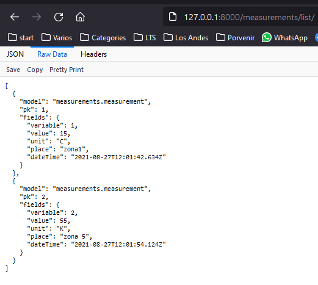
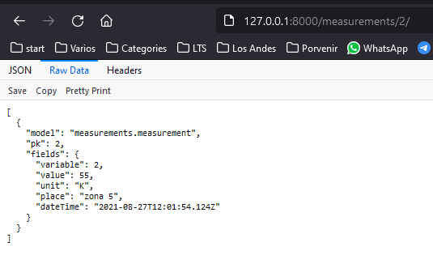
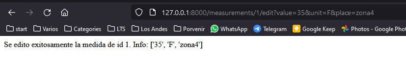
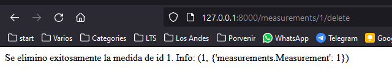

Diego Granada - 201922383

Perdon que entregue tarde, en serio se me olvido. Ya habia acabado todo el codigo hace como 4 dias.

Conseguir lista de medidas:

Conseguir una sola medida por ID:

Actualizar medida por ID usando query params:

Eliminar medida por ID:

